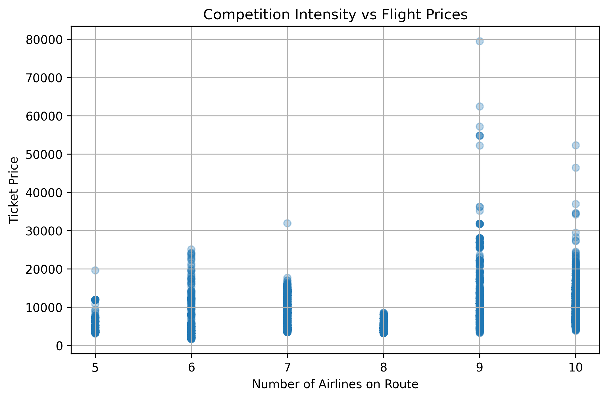

# Indian Airline Pricing & Competition Analysis

## Overview

project analyzes how competition intensity affects airline ticket pricing across Indian domestic routes using econometric regression techniques and route-level market analysis.

## Tools Used

- Python
- pandas
- matplotlib
- statsmodels
- scikit-learn

## Methodology

- Data cleaning & preprocessing
- Route-level competition analysis
- Feature engineering
- OLS regression modeling
- Statistical visualization

## Key Findings

- Competition intensity showed statistically significant relationships with ticket pricing
- Flight duration and stop frequency strongly influenced fares
- The regression model explained approximately 38% of ticket price variation

## Visualization

